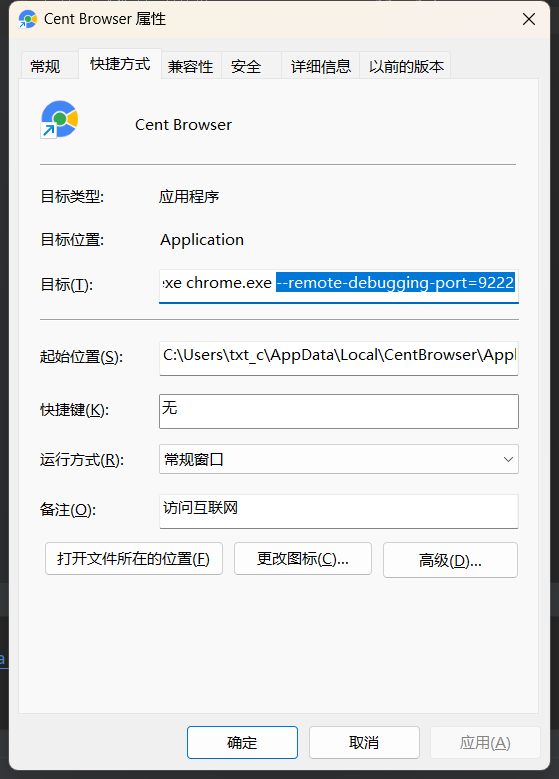
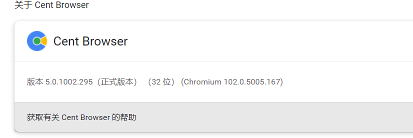

# 曲小惜的在线注入

本项目诞生原因是由于定时器不太好用，汪老板定制的程序，现在开源。

项目原理是通过webdev接口，将run.js的内容注入到文本框，模拟手动点击运行。

安装依赖：
```shell
pip install -r requirements.txt -i http://pypi.douban.com/simple/
```

1：使用唯一指定浏览器centbrowser启动

 说明：在快捷方式后面加上 --remote-debugging-port=9222
 
 

2：打开wsmud.aize.org 多开网页

3：手动登录账号上去

4：修改run.js 运行main.py 就能运行注入脚本了

运行其他流程的方法
```shell
python main.py xxx.js
```

# 关于下载chromedriver.exe

必须下载对应版本的，查看具体浏览器内核
https://chromedriver.chromium.org/downloads

# 关于编译：
运行pyinstaller -F main.py 即可编译成exe  

打包的时候 需要携带 chromedriver.exe 

# 使用其他浏览器，其他操作系统

如果想要用别的浏览器，自行替换对应版本的chromedriver.exe

# 定时任务
运行定时任务可以依赖windows定时任务，或者自行修改python脚本都可以

# 假如我有多个流程需要运行
```shell
python main.py xxx.js
```
已编译的
```shell
main.exe xxx.js
```

# 假如我有多个浏览器需要运行
浏览器的debug需要配置不同的端口，运行程序传递端口参数
```shell
python main.py 9991 xxx.js
```
已编译的
```shell
main.exe 9991 xxx.js
```